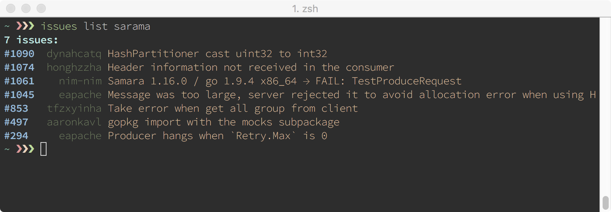

# Issues Command Line

This small utility helps you for query and follow repositories issues. The goal is following public repositories, so you do not need permission or an access token. Probably, I will add private repositories support, but now I only want to manage my favorite open source repositories.

## Requirements
- [Go](http://golang.org)

## How to install

    $ go install github.com/klassmann/issues

## Usage

    add	Adds a new query to your local configuration. You need to give a name to the query:
            $ issues add [query-name] [query parameters]
            $ issues add golang repo:golang/go is:open memory

    delete	Deletes a query from your local configuration.
            $ issues delete [query-name]
            $ issues delete golang

    list	Query issues from a [query-name] saved in local configuration:
            $ issues list [query-name]

    query	Queries and shows a new search on github:
            $ issues query [query-parameters]
            $ issues query repo:golang/go is:open memory

    queries	Show the list of queries in your configuration.
            $ issues queries

    help	Shows this help message.

## Configuration
Create a `.issuesrc` in your home directory. The file will be created automatically on first use.

    {
        "queries": 
        {
            "sarama": "repo:shopify/sarama is:open",
            "golang": "repo:golang/go is:open",
            "django": "repo:django/django is:open"
        }
    }

Note: Each query should have a name and a GitHub issue search string, see more [here](https://developer.github.com/v3/search/#search-issues).

## Features

- [X] Query issues from Github
- [X] Add, Delete and List queries from local configuration
- [X] Colorful output
- [X] Cache last query responses
- [ ] Github response pagination (Today the number is limited by default from github to 100 items)
- [ ] Get more issue details
- [ ] Unit tests

## Notes

- Inspired by [The Go Programming Language - Issue example](https://github.com/adonovan/gopl.io/tree/master/ch4/issues)
- Tested with go 1.9.1 darwin/amd64

## License
[Apache 2.0](LICENSE)
